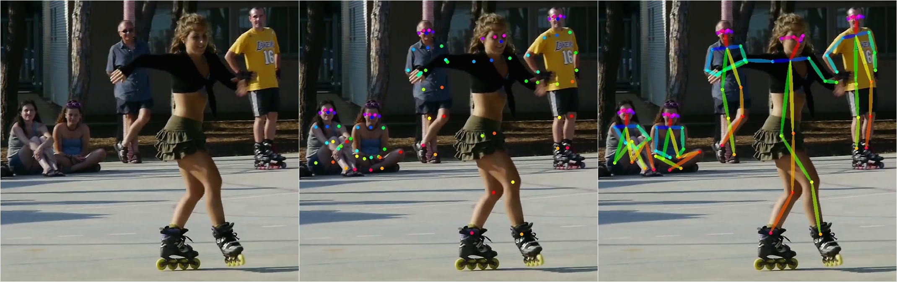
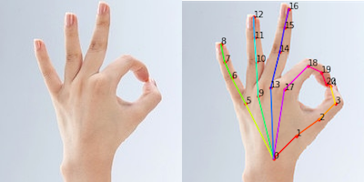
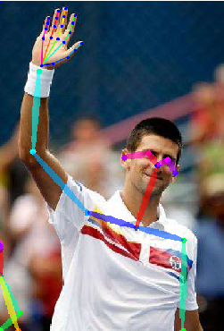

# PyTorch OpenPose

A PyTorch implementation of the OpenPose human pose estimation system. This project provides real-time **body and hand pose detection** capabilities through models converted directly from the original [CMU OpenPose](https://github.com/CMU-Perceptual-Computing-Lab/openpose) project using [caffemodel2pytorch](https://github.com/vadimkantorov/caffemodel2pytorch).

## Introduction

This implementation focuses on two key components:
- Body pose estimation (detecting body keypoints)
- Hand pose estimation (detecting hand keypoints)

The hand detection approach follows the methodology described in the original OpenPose implementation ([handDetector.cpp](https://github.com/CMU-Perceptual-Computing-Lab/openpose/blob/master/src/openpose/hand/handDetector.cpp)):

> "We directly use the body pose estimation models and use the wrist and elbow position to approximate the hand location, assuming the hand extends 0.15 times the length of the forearm in the same direction."

If this project helps your research, please consider giving it a star!

## Setup Guide

### Dependencies

1. Create a Python 3.7 environment:
```bash
conda create -n pose-env python=3.7
conda activate pose-env
```

2. Install PyTorch according to your system configuration:
   - Visit https://download.pytorch.org/whl/torch_stable.html for the appropriate commands

3. Install additional dependencies:
```bash
pip install -r requirements.txt
```

### Model Files

Download the pre-trained models from one of these sources:
* [Dropbox](https://www.dropbox.com/sh/7xbup2qsn7vvjxo/AABWFksdlgOMXR_r5v3RwKRYa?dl=0)
* [Baidu Cloud](https://pan.baidu.com/s/1IlkvuSi0ocNckwbnUe7j-g)
* [Google Drive](https://drive.google.com/drive/folders/1JsvI4M4ZTg98fmnCZLFM-3TeovnCRElG?usp=sharing)

Place the downloaded `.pth` files in a directory named `model` in the project root.

## Running the Application

The project offers three demo modes:

### Webcam Demo
Process video from your webcam in real-time:
```bash
python demo_camera.py
```

### Image Demo
Process a sample image:
```bash
python demo.py
```

### Video File Processing
Process an existing video file (requires [ffmpeg-python](https://pypi.org/project/ffmpeg-python/)):
```bash
python demo_video.py <path-to-video-file>
```

## Hardware Acceleration

This implementation is optimized for various hardware platforms:

- **NVIDIA GPUs**: Automatically utilizes CUDA acceleration when available for maximum performance
- **Apple Silicon**: Takes advantage of Metal Performance Shaders (MPS) on M1/M2/M3 Macs
- **CPU-only systems**: Runs efficiently on standard processors without dedicated graphics hardware

The system automatically selects the optimal processing device based on your hardware configuration.

## Key Features

- Cross-platform support (Windows, macOS, Linux)
- Multiple acceleration options (CPU, CUDA, MPS)
- Body keypoint detection
- Hand keypoint detection
- Real-time processing capability
- Support for image, video file, and webcam input

## Visual Examples

<div style="display: flex; flex-wrap: wrap; gap: 10px; justify-content: center;">
  <div style="flex: 1; min-width: 300px; max-width: 45%;">
    <h3>Body Keypoints</h3>
    
    
  </div>

  <div style="flex: 1; min-width: 300px; max-width: 45%;">
    <h3>Hand Keypoints</h3>
    
    
  </div>
</div>

### Video Processing Examples

<div style="display: flex; flex-wrap: wrap; gap: 20px; justify-content: center; margin-top: 20px;">
  <div style="flex: 1; min-width: 300px; max-width: 45%;">
    <h4>Body Pose Tracking</h4>
    
    <p><em>Source: <a href="https://www.youtube.com/watch?v=kc-e129SBb4">YouTube video</a></em></p>
  </div>

  <div style="flex: 1; min-width: 300px; max-width: 45%;">
    <h4>Hand Tracking</h4>
    
    <p><em>Source: <a href="https://www.youtube.com/watch?v=yOAmYSW3WyU">YouTube video</a></em></p>
  </div>
</div>
